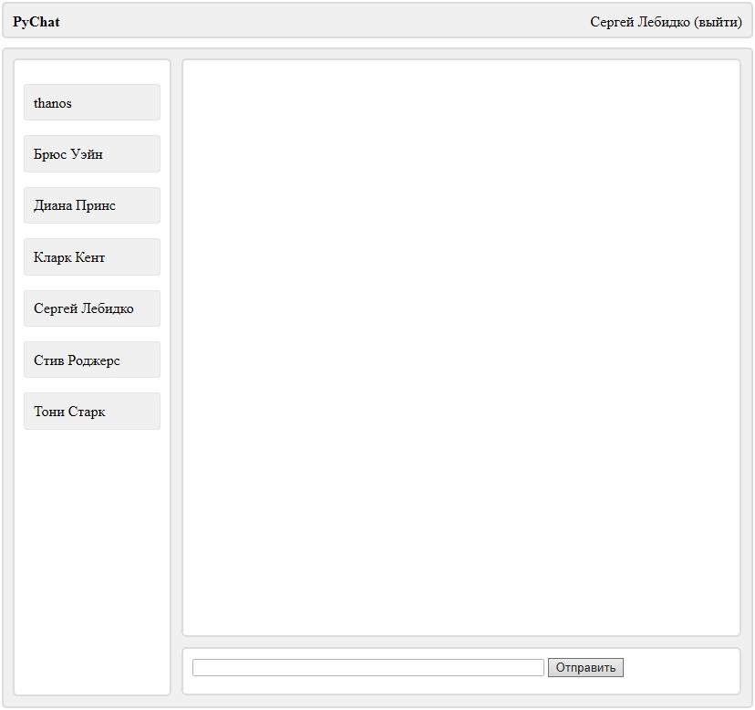
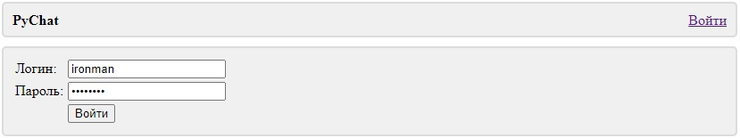
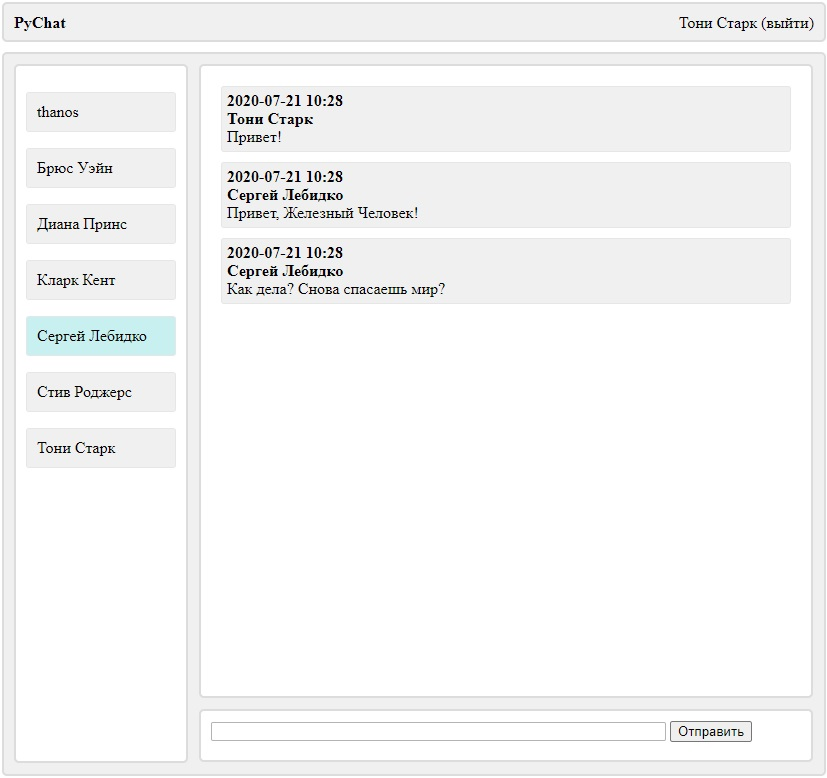

# PyChat

Простейший чат на Python и JavaScript. Это мой первый опыт практического применения JS и Ajax. У чата реализован простейший REST-API с авторизацией по токену.
Доступны следующие хуки: 

#### Получение токена
POST /chat/token/

На хук в HTTP-заголовке Authorization надо отправить пару логин:пароль в виде base64

Пример ответа:
```
{
  "token": "7c5a11211f8432c17006da8b2146a11a1fdcd683"
}
```

#### Получение списка пользователей
GET /chat/users/

На хук в HTTP-заголовке Authorization надо отправить токен в виде строки такого вида "Token 7c5a11211f8432c17006da8b2146a11a1fdcd683"
Это же касается и всех последующих хуков.

Пример ответа:
```
[
  {
    "id": 1,
    "username": "admin",
    "first_name": "Сергей",
    "last_name": "Лебидко"
  },
  {
    "id": 2,
    "username": "ironman",
    "first_name": "Тони",
    "last_name": "Старк"
  },
  {
    "id": 3,
    "username": "cap",
    "first_name": "Стив",
    "last_name": "Роджерс"
  }
]
```

#### Получение списка сообщений
GET /chat/messages/

для получения сообщений в диалоге между пользователями с id 1 и 2 надо в URL использовать параметр user. Пример: /chat/messages/?user=1&user=2

Пример ответа:
```
[
  {
    "id": 1083,
    "dt": "2020-07-21T10:28:10.054426+03:00",
    "text": "Привет!",
    "sender": 2,
    "receiver": 1,
    "sender_name": "Тони Старк",
    "receiver_name": "Сергей Лебидко"
  },
  {
    "id": 1084,
    "dt": "2020-07-21T10:28:34.775426+03:00",
    "text": "Привет, Железный Человек!",
    "sender": 1,
    "receiver": 2,
    "sender_name": "Сергей Лебидко",
    "receiver_name": "Тони Старк"
  },
  {
    "id": 1085,
    "dt": "2020-07-21T10:28:55.111429+03:00",
    "text": "Как дела? Снова спасаешь мир?",
    "sender": 1,
    "receiver": 2,
    "sender_name": "Сергей Лебидко",
    "receiver_name": "Тони Старк"
  }
]
```

#### Создание сообщения
POST /chat/messages/

На хук передаются параметры sender (id отправителя), receiver (id получателя) и text (непосредственно текст сообщения)

Скриншоты веб-интерфейса приложения:






